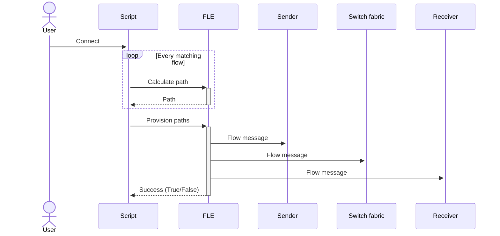
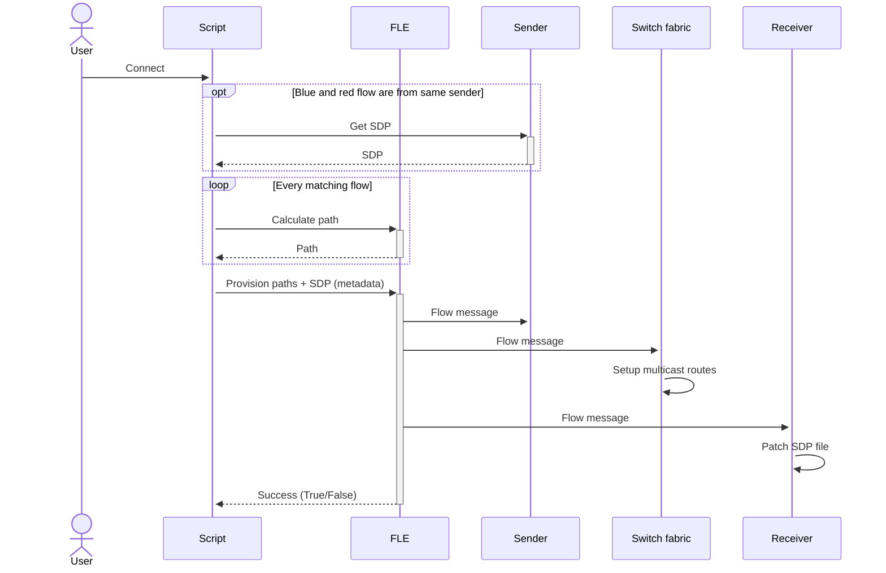
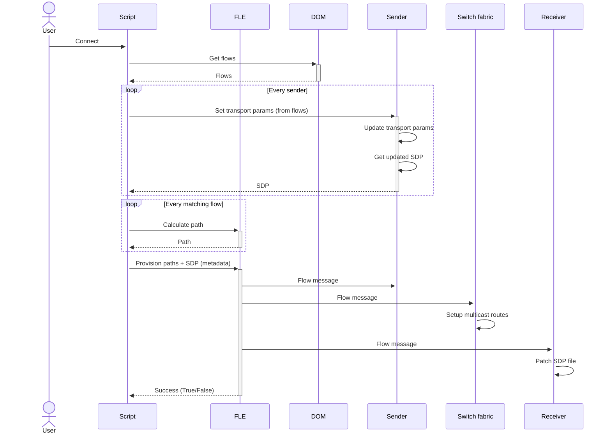
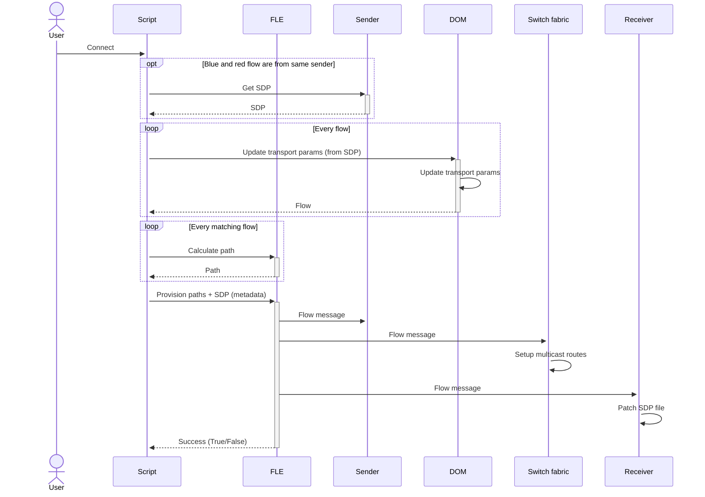

# Connection Management

This document describes what type of connections supported in MediaOps and how these are created.

## Connections based on levels

## Connections based on tags

## Connections using SDP files

The MediaOps solutions supports the use of SDP files when connecting IP flows.
This section describes the different modes how SDP files can be used and when these are applicable.

The type of mode will depend on the workflow that needs to be executed.

### SDP "Mode 0" (not using SDP)

This mode does not use SDP when creating connections. For every matching flow (see [levels](#connections-based-on-levels) and [tags](#connections-based-on-tags)), a path will be calculated by FLE.
Once all paths have been calculated, the paths will be provisioned by FLE, which means that a Flow InterApp message will be sent to every node in the path. The elements will use the transport parameters in the Flow to route or receive the source flow. 

### SDP "Mode 1"

Note that this is not supported yet.

### SDP "Mode 2"

Note that this is not supported yet.

In this mode, the transport parameters (source ip, multicast ip and port) from the flow are updated on the sender. 
Once these have been applied and the SDP has been updated accordingly, we will get the updated SDP from the sender and apply it to the receiver.

### SDP "Mode 3"

Note that this is not supported yet.

In this mode, the SDP file is retrieved from the sender and used to update the transport parameters (source ip, multicast ip and port) of the flow.
Once the flow is updated, the path is calculated and created using FLE and the SDP is applied to the receiver.